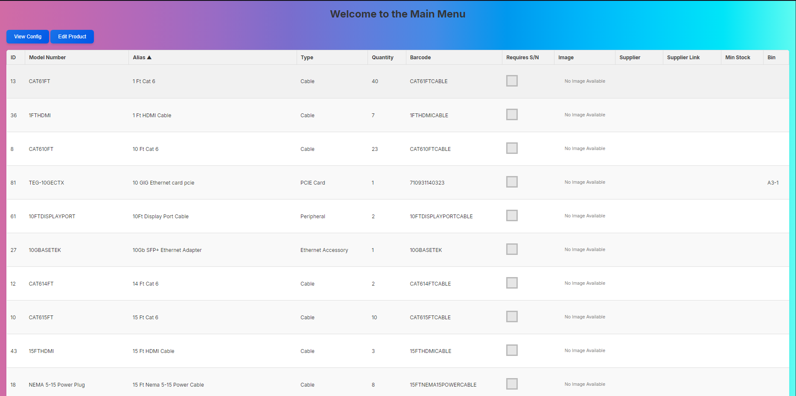

# THIS IS VERY EARLY DEVELOPMENT AND NOT FULLY FUNCTIONAL

# Project Documentation

## Overview
This project is designed to take in and store data about all of your products. It aims to simplify inventory management with a small learning curve for smaller teams who may or may not want to buy a large software package.

## Contributing
To contribute to this project, follow these steps:
1. Fork the repository
2. Create a new branch: `git checkout -b feature-branch`
3. Make your changes and commit them: `git commit -m 'Add some feature'`
4. Push to the branch: `git push origin feature-branch`
5. Open a pull request

## Screenshots
